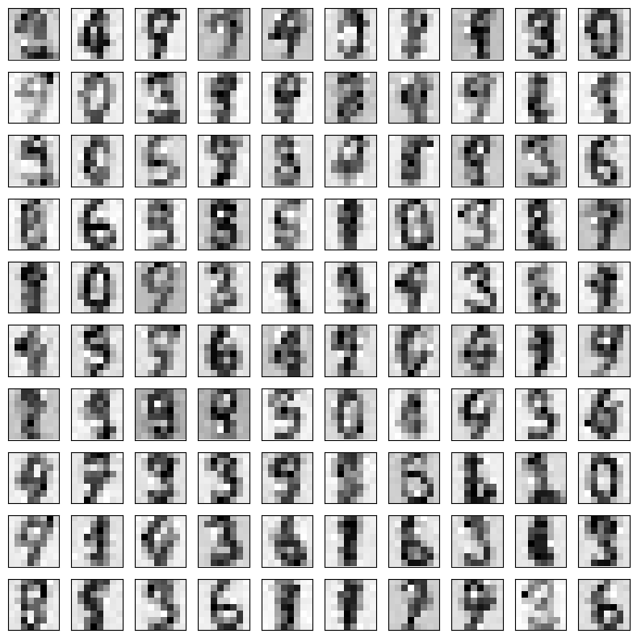

# Normalizing Flows on Digits Dataset

This is a simple implementation of normalizing flow (affine coupling layer) concepts, created for the PiMA project to illustrate the methodology on the scikit-learn Digits dataset. 

## Overview
Normalizing Flows transform a simple base distribution (e.g., Gaussian/Logistic) into a complex target distribution via a sequence of invertible mappings, enabling:
- **Exact log-likelihood** computation for training
- **Sampling** to generate new data

## Pipeline
- **Data**: scikit-learn Digits (8×8 grayscale)
- **Preprocessing**: scaling/normalization
- **Model**: affine coupling layers + log-det-Jacobian
- **Training**: maximize log-likelihood (optimize NLL)

## Results
- Trained flow generates digit-like images.
- Example samples:

